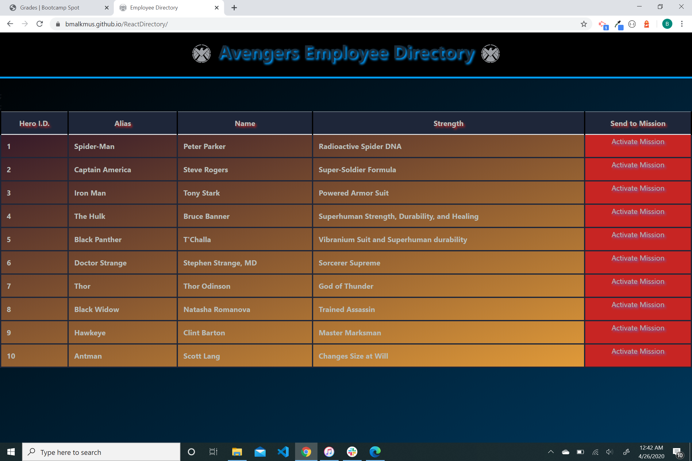
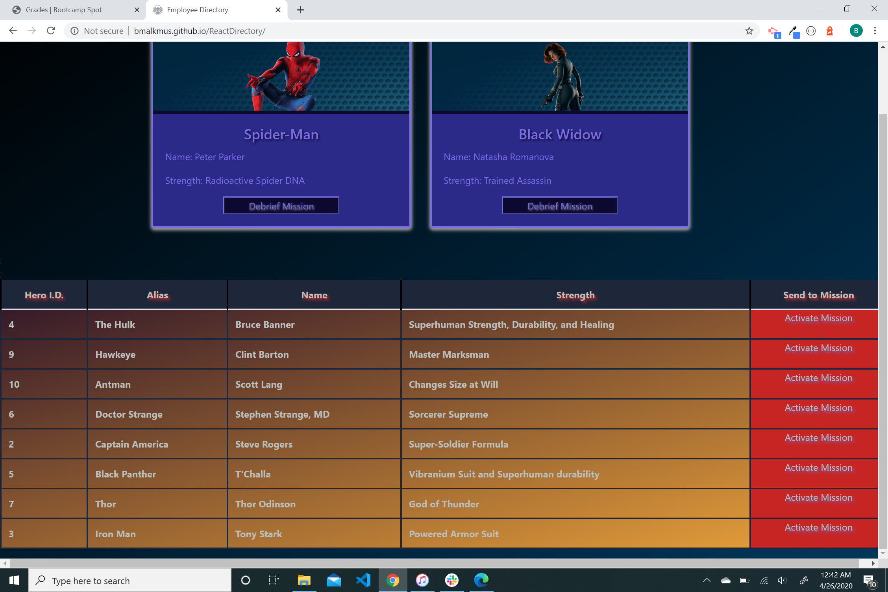

# ReactDirectory
Employee Directory using Creat-React-App
## Description
A simple employee directory using React class components and state changes. Clicking the buttons on the table will filter the directory between active and inactive employees. Clicking the heading of the tables will sort the tables alphabetically or in numerical value. 
## Contact
Please contact me at bmalkmus@uw.edu for any support issues.
## Acknowledgment
I would like to thank of all my teachers and TAs at University of Washington's Coding Bootcamp.   
Built with:  
* create-react-app  
* google images for all png files.

## License
[MIT](https://choosealicense.com/licenses/mit/)

## Screenshots 
**Landing Page** 
 
   
 **Filter** 
 
  
**Sort** 
 
